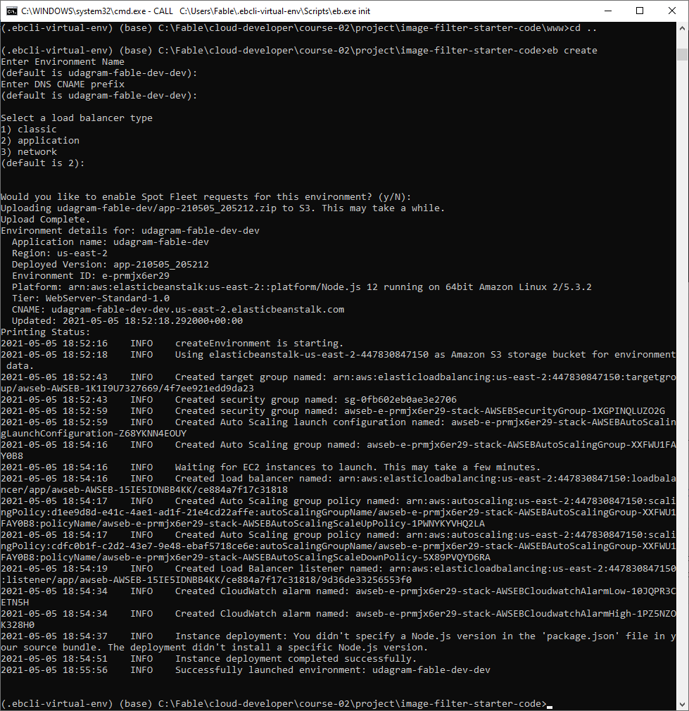
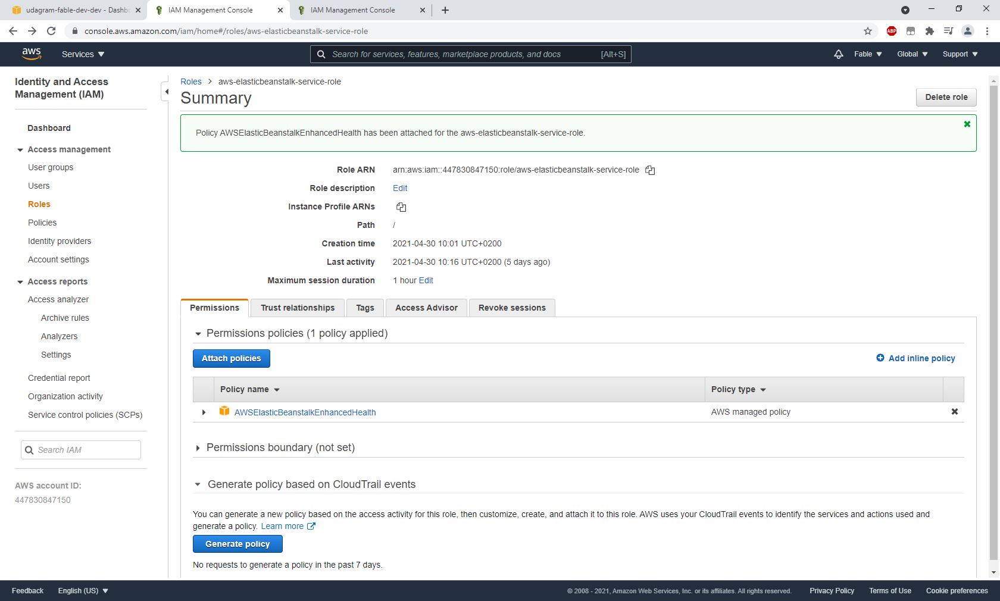
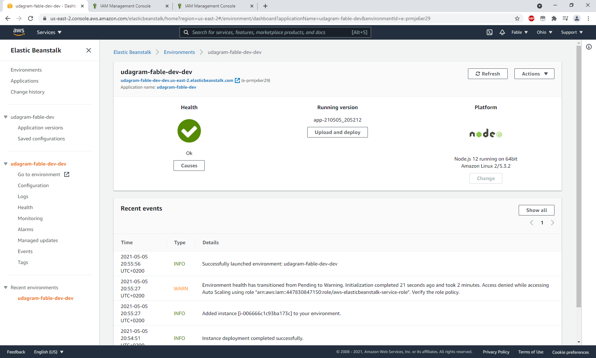
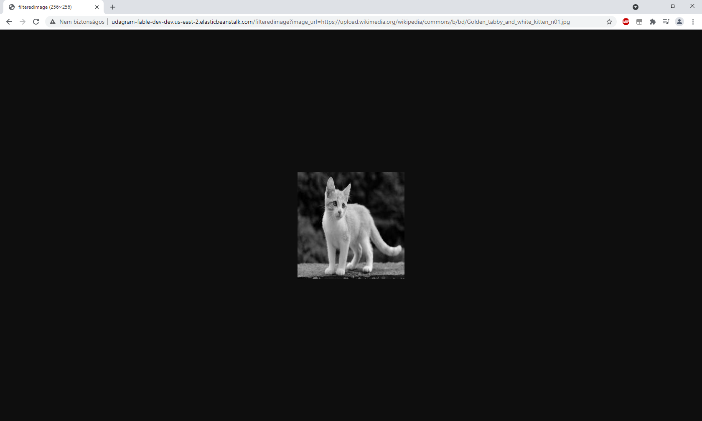

# Udagram Image Filtering Microservice

Test using EB URL:
http://udagram-fable-dev-dev.us-east-2.elasticbeanstalk.com/filteredimage?image_url=https://upload.wikimedia.org/wikipedia/commons/b/bd/Golden_tabby_and_white_kitten_n01.jpg

## Project Rubric

### Engineering Process and Quality
```
The project demonstrates an understanding of a good cloud git process
All project code is stored in a GitHub repository and this link has been submitted for review. There are at least two branches - one for development (dev, development) and one master. Master should contain the most up-to-date, stable code at the time of submission.
```
I have created a dev branch, and changed the master to force review. The repository is at https://github.com/Fable3/cloud-developer/tree/master/course-02/project/image-filter-starter-code
```
The project demonstrates an ability to use typescript and Nodejs
Any variables use typescript typing wherever possible, variable and function names are clear, endpoints are logically named. Good coding practices are followed.
```

Implemented the filterimage endpoint:
```typescript
  app.get("/filteredimage/", async (req, res) =>{
    // 1. validate the image_url query
    let { image_url } = req.query;
    if (!image_url){
      return res.status(400)
        .send(`imageurl is required`)
    }
    //    2. call filterImageFromURL(image_url) to filter the image
    try {
      const filtered_image = await filterImageFromURL(image_url).catch((e) => { throw e; });
      //    3. send the resulting file in the response
      res.status(200).sendFile(filtered_image, async(err) =>{
        //    4. deletes any files on the server on finish of the response
        deleteLocalFiles([filtered_image]);
      });
    } catch(e)
    {
      return res.status(422).send(`image not found`)
    }
  });
```
The interesting part here is the error handling. If the URL does not point to a valid image, Node.js terminates the server with the following error:
`(node:348) UnhandledPromiseRejectionWarning: Error: Could not find MIME for Buffer <null> at Jimp.parseBitmap`

To handle promise rejection, I modified the utility function:
```typescript
export async function filterImageFromURL(inputURL: string): Promise<string>{
    return new Promise( async (resolve, reject) => {
        Jimp.read(inputURL).then(async photo => {
            const outpath = '/tmp/filtered.'+Math.floor(Math.random() * 2000)+'.jpg';
            await photo
            .resize(256, 256) // resize
            .quality(60) // set JPEG quality
            .greyscale() // set greyscale
            .write(__dirname+outpath, (img)=>{
                resolve(__dirname+outpath);
            });
        }).catch(e=>{
            reject("image not found");
        });
    });
}
```
In case of error, the `reject` method in the caller's `catch` throws an exception, which results an error message at the client without crashing the server.

### Development Server
```
The project demonstrates the ability to develop using the NodeJS framework
Starting the server with npm run dev runs a local instance of the server with no errors
```
I get the following output:
```
(base) c:\Fable\cloud-developer\course-02\project\image-filter-starter-code>npm run dev

> udacity-c2-image-filter@1.0.0 dev c:\Fable\cloud-developer\course-02\project\image-filter-starter-code
> ts-node-dev ./src/server.ts

Using ts-node version 8.3.0, typescript version 3.5.3
server running http://localhost:8082
press CTRL+C to stop server
```

```
The project demonstrates an understanding of RESTFUL design
The stubbed @TODO1 endpoint in src/server.ts is completed and accepts valid requests including:
http://localhost:{{PORT}}/filteredimage?image_url=https://upload.wikimedia.org/wikipedia/commons/b/bd/Golden_tabby_and_white_kitten_n01.jpg
```
Here's a screenshot of the result:


```
The project demonstrates an understanding of HTTP status codes
Successful responses have a 200 code, at least one error code for caught errors (i.e. 422)
```

I use 400 for missing parameter, and the suggested 422 Unprocessable Entity for missing image.

### Elastic Beanstalk Deployment

```
The project demonstrates the ability to create functional cloud deployments
An endpoint URL for a running elastic beanstalk deployment (EB_URL) has been submitted along with the project submission. This endpoint responds to valid GET requests including:...
```

http://udagram-fable-dev-dev.us-east-2.elasticbeanstalk.com/filteredimage?image_url=https://upload.wikimedia.org/wikipedia/commons/b/bd/Golden_tabby_and_white_kitten_n01.jpg

```
The project demonstrates an understanding of AWS Elastic Beanstalk’s CLI and Console Dashboard
The project was deployed using the AWS Elastic Beanstalk CLI eb init, eb create, and eb deploy commands.
A screenshot of the elastic beanstalk application dashboard is included in a deployment_screenshot directory.
```

After `eb init`, I've added the following to `.elasticbeanstalk\config.yml `

```
deploy:
  artifact: ./www/Archive.zip
```

After creating the zip file, here's the screenshot of the result of `eb create`



Since the create command also deployed the code, the deploy command was not necessary at this time.

The deployment had an issue with the added role not having access to Auto Scaling. After some research, I added the following policy:



After this, the EB environment turned to green checkmark:



And here's the test result of the service:

